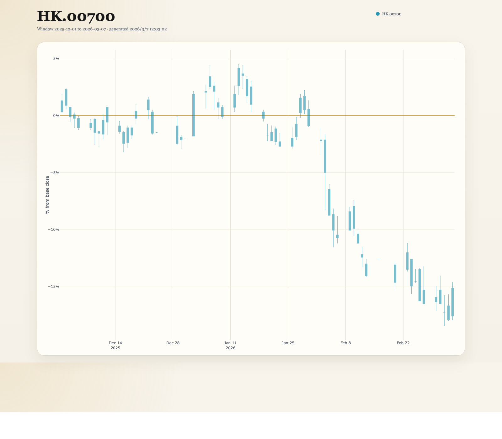
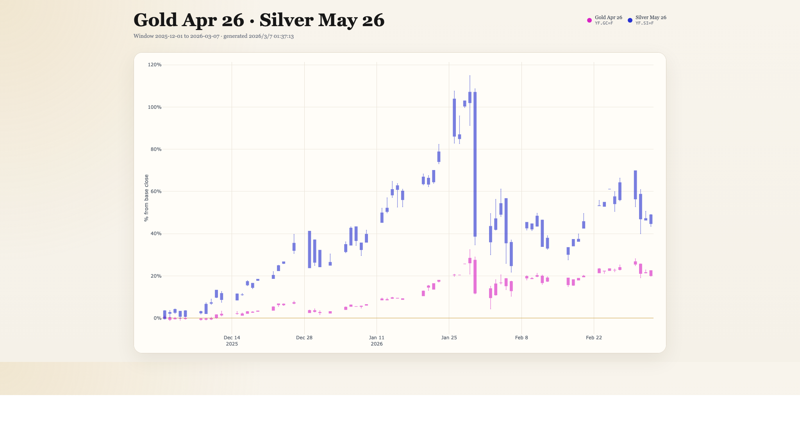

# relchart

Relative daily K-line overlay web tool.

`relchart` starts a local web server and renders a fixed-window multi-symbol percentage candlestick chart in the browser. Daily-bar fetching and cache repair happen when you visit a chart URL, not when the server starts.

## Contents

- `relchart.py`: CLI entrypoint
- `relchart/cli.py`: argument parsing and server startup
- `relchart/app.py`: data sync, cache management, snapshot building
- `relchart/providers/yahoo.py`: Yahoo Finance daily-bar provider
- `relchart/storage.py`: monthly cache file read/write
- `relchart/web/static/`: standalone web assets
- [`docs/issue-1-design.md`](docs/issue-1-design.md): design document

## Data Source Support

- Currently uses public Yahoo Finance daily bars through `yfinance`
- Supports `US.*`, `HK.*`, and `YF.*` symbol inputs
- Does not depend on Futu OpenD
- Requires outbound internet access when cache is missing or current-month data needs refresh
- Data fetch is triggered by page/API access, not by server startup

Yahoo symbol mapping examples:

- `US.AAPL -> AAPL`
- `US.BRK.B -> BRK-B`
- `HK.00700 -> 0700.HK`
- `HK.700 -> 0700.HK` (normalized to canonical `HK.00700`)
- `YF.GC=F -> GC=F`
- `YF.SI=F -> SI=F`

`HK.*` uses numeric HKEX codes, not name aliases. Use the exchange code after the `HK.` prefix
and prefer the 5-digit canonical form:

- Tencent: `HK.00700`, not `HK.TCH`
- Alibaba-W: `HK.09988`

For Yahoo Finance, relchart converts the canonical 5-digit HK code to a 4-digit `.HK` symbol
by dropping one leading zero. Example: `HK.00700 -> 0700.HK`.

`YF.*` is a raw Yahoo Finance passthrough prefix. It is useful for Yahoo-native symbols that are
not plain stock tickers, such as:

- futures like `GC=F` and `SI=F`
- forex pairs like `EURUSD=X`
- indices like `^GSPC`
- crypto pairs like `BTC-USD`

For `YF.*`, relchart uses best-effort trading-calendar inference. `GC=F` and `SI=F` are explicitly
aligned to Yahoo's current daily-bar behavior and use an `XNYS`-style completed-day schedule;
common `=X`, `-USD`, `=F`, and `^...` forms also have built-in heuristics.
When Yahoo returns a `shortName`, relchart uses that English display name in the page title,
legend, and hover labels, while still showing the original symbol as secondary text.

## Quick Start

Create and activate a virtual environment:

```bash
python -m venv .venv
source .venv/bin/activate
pip install -r requirements.txt
```

Start the web app:

```bash
python relchart.py
```

Then open:

```text
http://127.0.0.1:19090/kline?stocks=US.AAPL,US.TSLA
```

You can also pass a single stock code and view a single-symbol daily K chart.

## Command Syntax

```bash
python relchart.py [--data_dir DIR] [--web_host HOST] [--web_port PORT] [--repair-history]
```

## Arguments

- `--data_dir`: cache directory for monthly K-line files, default `./.stocks`
- `--web_host`: local web server host, default `127.0.0.1`
- `--web_port`: local web server port, default `19090`
- `--repair-history`: re-fetch historical window months even if files already exist

## Examples

Start server:

```bash
python relchart.py
```

Open one US stock:

```text
http://127.0.0.1:19090/kline?stocks=US.AAPL
```

Open one HK stock:

```text
http://127.0.0.1:19090/kline?stocks=HK.700
```

`HK.700` is normalized to canonical `HK.00700` and renders a single-symbol daily K chart.

Example page for `HK.700`:



Open multiple US stocks:

```text
http://127.0.0.1:19090/kline?stocks=US.AAPL,US.TSLA
```

Open HK stocks:

```text
http://127.0.0.1:19090/kline?stocks=HK.00700,HK.09988
```

Open Yahoo raw symbols:

```text
http://127.0.0.1:19090/kline?stocks=YF.GC%3DF,YF.SI%3DF
```

When a Yahoo raw symbol contains reserved URL characters such as `=`, encode the query value when
writing the URL manually. The frontend already does this automatically for API requests.

Example page for `YF.GC=F,YF.SI=F`:



Start server on a different port:

```bash
python relchart.py --web_port 18080
```

Then open:

```text
http://127.0.0.1:18080/kline?stocks=US.AAPL,US.TSLA,US.NVDA
```

Force historical month rebuild in current window when a symbols page is opened:

```bash
python relchart.py --repair-history
```

## Runtime Behavior

- Server startup itself does not fetch any market data
- Daily-bar fetch and cache repair are triggered when a chart page or chart-data API is requested
- Fixed window only: previous 3 full natural months plus current month to the latest completed trading day
- Browser time-range controls are intentionally disabled
- Y-axis is percentage, not raw price
- For each symbol, cache files are written as one file per month
- Historical months are only written if the fetched month is complete
- Current month is allowed to be partial and is refreshed against the latest completed trading day

Cache layout example:

```text
.stocks/
  us.aapl/
    us.aapl_202512.txt
    us.aapl_202601.txt
    us.aapl_202602.txt
    us.aapl_202603.txt
  us.tsla/
    us.tsla_202512.txt
```

Cache file format:

```text
20260201 260 261 257 260.5
20260202 260.5 263 255 262
```

Columns are:

- `date`
- `open`
- `high`
- `low`
- `close`

## HTTP Endpoints

- `GET /`: empty shell page with usage hint
- `GET /kline?stocks=...`: chart page for a comma-separated stock list, for example `/kline?stocks=US.AAPL,US.TSLA`
- `GET /api/chart-data?stocks=...`: chart snapshot used by the frontend
- `GET /healthz`: basic health status

## Notes

- Frontend uses local Plotly assets under `relchart/web/static/`
- No Node.js build step is required
- `requirements.txt` includes `scipy`, so Yahoo price repair should be enabled by default after a normal install
- First request for a chart page can take longer because missing monthly cache files must be fetched
- Request logs include per-file local read timing, per-remote-call timing, and per-page aggregate timing

## Troubleshooting

- `ModuleNotFoundError: fastapi` or `uvicorn` or `yfinance`: run `pip install -r requirements.txt`
- Empty chart or request failure: check internet connectivity, stock code format, and the `stocks` query parameter in the URL
- `YF.*` symbols are passed to Yahoo as-is; if Yahoo itself does not recognize the symbol, relchart cannot repair it locally
- `HK.*` symbols must use numeric HKEX codes; for example, Tencent is `HK.00700`, not `HK.TCH`
- Historical file suspected bad or incomplete: delete the specific month file and restart the program
- Port already in use: change `--web_port`
