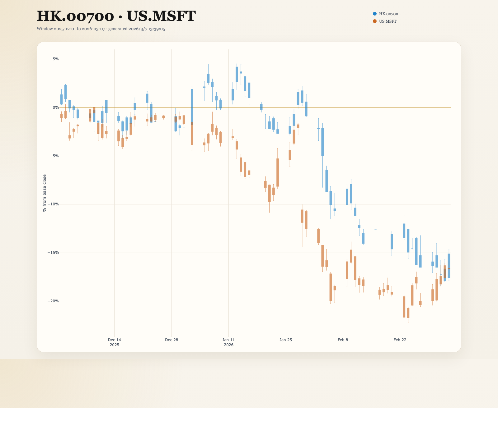
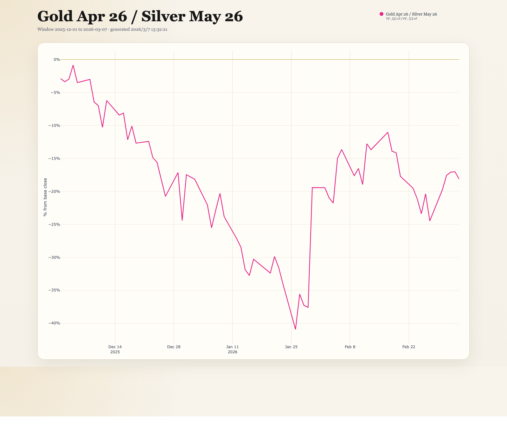
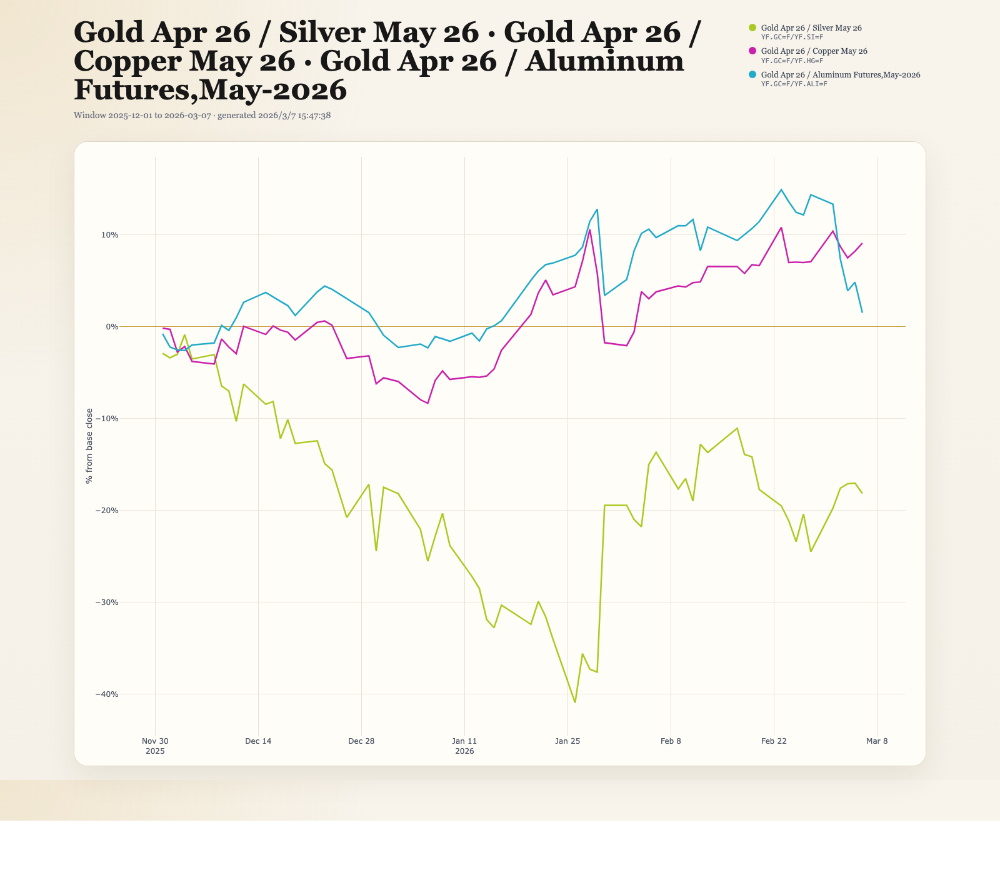
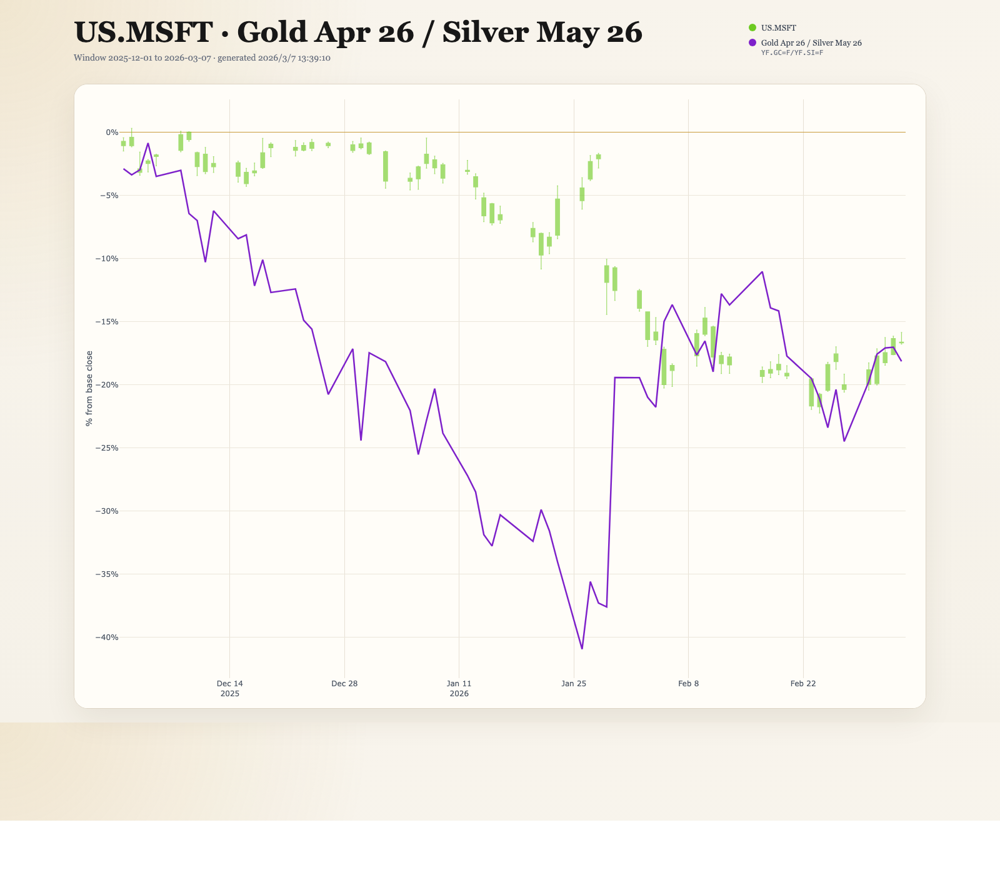

中文版本：[README.md](./README.md)

# relchart

Relative daily K-line overlay web tool.

`relchart` starts a local web server and renders a fixed-window multi-symbol percentage candlestick chart in the browser. Month files are read on demand when you visit a chart URL; missing files are downloaded, written to disk, and then read back from the local cache.

## Data Source Support

- Currently uses public Yahoo Finance daily bars through `yfinance`
- Supports `US.*`, `HK.*`, and `YF.*` symbol inputs
- Supports ratio items in `<symbol>/<symbol>` form, such as `YF.GC=F/YF.SI=F`
- Does not depend on Futu OpenD
- Requires outbound internet access when a month file is missing
- Data fetch is triggered by page/API access, not by server startup

Yahoo symbol mapping examples:

- `US.AAPL -> AAPL`
- `US.BRK.B -> BRK-B`
- `HK.00700 -> 0700.HK`
- `HK.700 -> 0700.HK` (normalized to canonical `HK.00700`)
- `YF.GC=F -> GC=F`
- `YF.SI=F -> SI=F`

`HK.*` uses numeric HKEX codes, not name aliases. Use the exchange code after the `HK.` prefix
and prefer the 5-digit canonical form:

- Tencent: `HK.00700`, not `HK.TCH`
- Alibaba-W: `HK.09988`

For Yahoo Finance, relchart converts the canonical 5-digit HK code to a 4-digit `.HK` symbol
by dropping one leading zero. Example: `HK.00700 -> 0700.HK`.

`YF.*` is a raw Yahoo Finance passthrough prefix. It is useful for Yahoo-native symbols that are
not plain stock tickers, such as:

- futures like `GC=F` and `SI=F`
- forex pairs like `EURUSD=X`
- indices like `^GSPC`
- crypto pairs like `BTC-USD`

For `YF.*`, relchart uses best-effort trading-calendar inference. `GC=F` and `SI=F` are explicitly
aligned to Yahoo's current daily-bar behavior and use an `XNYS`-style completed-day schedule;
common `=X`, `-USD`, `=F`, and `^...` forms also have built-in heuristics.
When Yahoo returns a `shortName`, relchart uses that English display name in the page title,
legend, and hover labels, while still showing the original symbol as secondary text.

Ratio items use `<symbol>/<symbol>` syntax. They are rendered as line traces based on daily close
ratios and can be mixed with regular candlestick symbols in the same `stocks` query.

## Quick Start

Create and activate a virtual environment:

```bash
python -m venv .venv
source .venv/bin/activate
pip install -r requirements.txt
```

Start the web app:

```bash
python relchart.py
```

Optional flags:

- `--data_dir DIR`
- `--web_host HOST`
- `--web_port PORT`

Then open:

```text
http://127.0.0.1:19090/kline?stocks=US.AAPL,US.TSLA
```

You can also pass a single stock code and view a single-symbol daily K chart.

## Examples

Open one stock:

[`http://127.0.0.1:19090/kline?stocks=HK.700`](http://127.0.0.1:19090/kline?stocks=HK.700)

`HK.700` is normalized to canonical `HK.00700` and renders a single-symbol daily K chart.


Compare stocks:

[`http://127.0.0.1:19090/kline?stocks=HK.00700,US.MSFT`](http://127.0.0.1:19090/kline?stocks=HK.00700,US.MSFT)



Open Yahoo raw symbols:

[`http://127.0.0.1:19090/kline?stocks=YF.GC=F,YF.SI=F`](http://127.0.0.1:19090/kline?stocks=YF.GC%3DF,YF.SI%3DF)


Open one ratio line:

[`http://127.0.0.1:19090/kline?stocks=YF.GC=F/YF.SI=F`](http://127.0.0.1:19090/kline?stocks=YF.GC%3DF%2FYF.SI%3DF)



Compare ratio lines:

[`http://127.0.0.1:19090/kline?stocks=YF.GC=F/YF.SI=F,YF.GC=F/YF.HG=F,YF.GC=F/YF.ALI=F`](http://127.0.0.1:19090/kline?stocks=YF.GC%3DF%2FYF.SI%3DF,YF.GC%3DF%2FYF.HG%3DF,YF.GC%3DF%2FYF.ALI%3DF)



Open a mixed chart with candlesticks and a ratio line:

[`http://127.0.0.1:19090/kline?stocks=US.MSFT,YF.GC=F/YF.SI=F`](http://127.0.0.1:19090/kline?stocks=US.MSFT,YF.GC%3DF%2FYF.SI%3DF)



When a Yahoo raw symbol contains reserved URL characters such as `=`, encode the query value when
writing the URL manually. The frontend already does this automatically for API requests.

## Learn More

- Month files are read from `data_dir` on demand; if a file is missing, relchart downloads it and
  stores it locally
- If you want to refresh a symbol's data, delete the corresponding month file under `data_dir` and
  request the page again
- Cache layout, file format, HTTP endpoints, and other implementation notes are in
  [`docs/technical-details_en.md`](docs/technical-details_en.md)

## Troubleshooting

- `ModuleNotFoundError: fastapi` or `uvicorn` or `yfinance`: run `pip install -r requirements.txt`
- Empty chart or request failure: check internet connectivity, stock code format, and the `stocks` query parameter in the URL
- `YF.*` symbols are passed to Yahoo as-is; if Yahoo itself does not recognize the symbol, relchart cannot repair it locally
- Port already in use: change `--web_port`
