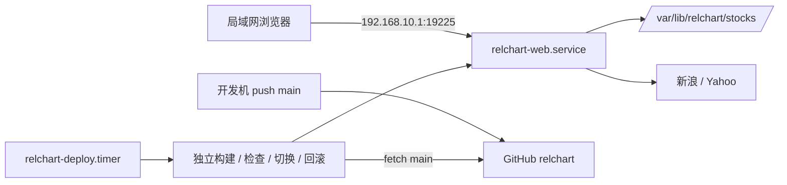

# osaka 部署与自动更新方案

状态：已部署并启用自动更新。核查日期：2026-10-06。

采用与 `~/workspace/opdash` 相同的 **独立版本目录 + Python venv + systemd 服务 + timer 拉取发布**，由 relchart 自身直接监听 `192.168.10.1:19225`，提供 `http://192.168.10.1:19225/`。

## 已核实的现状

| 项目 | 结果 |
| --- | --- |
| 目标主机 | `ssh osaka`，Ubuntu 26.04 LTS、x86_64、Python 3.14.4 |
| LAN | `enp9s0f0np0`，`192.168.10.1/24` |
| 资源 | 约 15 GiB 内存，磁盘可用约 711 GiB |
| 现有服务 | `opdash-web.service` 和 `opdash-deploy.timer` 均 active，HTTP 使用 18080 |
| 新服务端口 | Uvicorn 直接监听 `192.168.10.1:19225`，无需 nginx |
| 代码来源 | `https://github.com/hangchow/relchart.git`，匿名读取成功 |
| 发布分支 | 远端默认分支为 `main`，不是 opdash 的 `master` |
| 当前远端提交 | `ba833d0`（开始实施时） |
| 首次部署提交 | `7864fd3`，部署实现及测试已提交并 push |
| 当前权限 | 已通过 sean 登录并完成管理员身份验证；已核对 UFW 和现有应用规则 |

参考实现：`../opdash/docs/deployment.md`、`../opdash/deploy/deploy.py` 以及其 systemd units。可以复用事务、锁、失败回滚和版本清理设计，不能直接原样复制发布器：仓库分支、入口、静态资源路径及检查接口均不同。

## 访问和运行结构



首页保留当前使用提示，图表 URL 为 `http://192.168.10.1:19225/kline?stocks=US.AAPL,HK.00700`。全部标的使用同一个 `stocks` 参数，无固定数量上限。

与 opdash 一样，应用监听 `0.0.0.0`，以普通系统用户直接提供 HTTP；relchart 使用 19225，opdash 使用 18080。服务器本机的健康检查访问 `http://127.0.0.1:19225`，LAN 浏览器访问 `http://192.168.10.1:19225/`。FastAPI/Uvicorn 同时提供页面、静态资源和 API。

relchart 使用 Sina/Yahoo 日线数据及独立文件缓存，部署范围为图表服务和代码自动发布。

## 目录与配置

```text
/opt/relchart/
  releases/<完整 commit SHA>/    # 代码、静态资源、该版本独立 .venv
  current -> releases/<sha>
  previous -> releases/<sha>
/var/lib/relchart/
  stocks/sina/<symbol>/          # 当前数据源的月度日线缓存
  stocks/yahoo/<symbol>/         # 切换 provider 后使用的独立缓存
/var/cache/relchart/             # 第三方库的可写缓存
/var/lib/relchart-deploy/
  repo.git/
  state.json
  deploy.lock
/etc/relchart/relchart.env
/usr/local/libexec/relchart/     # 管理员安装的固定启动、发布程序
/etc/systemd/system/            # web.service、deploy.service、deploy.timer
```

运行配置：

```ini
WEB_HOST=0.0.0.0
WEB_CHECK_HOST=127.0.0.1
WEB_PORT=19225
DATA_DIR=/var/lib/relchart/stocks
PROVIDER=sina
TZ=Asia/Shanghai
CHART_TIMEOUT=120
```

固定 `deploy/start.py` 将监听地址、端口、缓存目录和数据源转为 CLI 参数；`WEB_CHECK_HOST` 由发布器用于探测服务，`TZ` 作为进程环境传入；Web unit 另设 `XDG_CACHE_HOME=/var/cache/relchart`，部署 unit 使用自身独立缓存目录。当前 CLI 不会自动读取这些配置。等价启动命令：

```bash
/opt/relchart/current/.venv/bin/python -u /opt/relchart/current/relchart.py \
  --web_host 0.0.0.0 --web_port 19225 \
  --data_dir /var/lib/relchart/stocks --provider sina
```

缓存路径由代码按 `data_dir / provider` 拼接，所以当前缓存实际位于 `/var/lib/relchart/stocks/sina/`。不能将 `DATA_DIR` 设置成已含 `sina` 的路径，否则会形成 `sina/sina/`。

首次部署可以将本机 `.stocks/sina/` 复制到服务器的 `stocks/sina/`，在首次启动前完成所有权校正。缓存不进入 Git、不放入 release，不随发布或回滚删除。开发机的 macOS `.venv` 不复制，服务器使用 Linux Python 重建。

## 运行和入口服务

创建独立系统用户 `relchart` 和 `relchart-deploy`。前者可读取代码，只能写入运行状态与缓存目录；后者可写 release 和发布状态，以非 root 身份安装依赖。发布用户仅获得固定的 `systemctl start/stop/restart relchart-web.service` 权限。

应用使用单进程，不启用 reload 或多个 worker。配置 `Restart=on-failure`、`RestartSec=10s`、停止超时 30 秒，初始资源预算为单核 CPU、1 GiB 内存。部署任务预算为单核 CPU、2 GiB 内存，并降低调度优先级。设置 `ProtectSystem=strict`、`ProtectHome=yes` 和显式可写状态/缓存目录；运行进程禁用额外提权。按实际行情加载峰值调整预算。

19225 与本地开发端口一致。应用以 `relchart` 用户运行，无需低位端口 capability。与 opdash 一样，独立的 `relchart_guard` nft 表允许回环访问和 LAN 接口 `enp9s0f0np0` 上来源 `192.168.10.0/24`、目标 `192.168.10.1` 的 TCP 19225 请求，UFW 同步放行该 LAN 端口。规则只管理本应用端口。

## 自动发布流程

发布器每轮结束后等待约 60 秒，再检查远端 `main`。本地修改文件或只 commit 不会触发；push 后的发布延迟包含轮询、依赖安装、测试及服务检查时间。

1. 获取部署锁，检查暂停标志，优先恢复上次未完成的事务。手工操作与 timer 共用同一把锁。
2. 有超时地 fetch `refs/heads/main`，解析完整 SHA。目标 SHA 与当前一致则退出，不重启服务；拉取失败保留现有版本。
3. 将目标 SHA 导出到最终 release 路径，在该路径创建独立 venv，以目标平台验证的 `requirements.lock` 安装全部锁定依赖。准备失败不影响运行版本，不移动已经建立的 venv。
4. 运行 `pip check`、编译/导入检查、`unittest discover -s tests -v`、静态资源检查及离线 HTTP 绘图冒烟测试。测试使用固定日期、测试 provider 和独立临时数据目录，不写生产缓存。
5. 记录旧 SHA、目标 SHA 和发布阶段；停止旧进程，原子替换 `current` 软链，然后启动新进程。保留数秒切换中断，不承诺零停机。
6. 期限内连续三次从服务器本机访问 `http://127.0.0.1:19225`：`/healthz` 的目标发布 SHA、`/readyz`、首页及 JS/CSS/Plotly。检查实际进程就绪，不能仅凭软链指向或 HTTP 200 判断。
7. 成功后更新 `previous`、成功 SHA 和完成时间；从 LAN 客户端直连应用检查主页与图表 API。首次上线还验证真实 Sina 数据，并按需验证 Yahoo。外部行情超时或限流单独记为数据源问题，不能自动判定为新代码故障。
8. 新版本启动或本地就绪检查失败，恢复旧软链、重启并检查旧版本；首次没有可回滚版本时记录失败。回滚也失败则暂停自动发布并保留诊断状态。
9. 失败 SHA 冷却 30 分钟，支持手工重试；新 SHA 可立即处理。保留最近 3 个成功 release，清理始终保护 current、previous 和事务涉及的目录，不涉及缓存。

定时器配置：

```ini
[Unit]
Description=Check relchart main updates

[Timer]
OnBootSec=2min
OnUnitInactiveSec=60s
AccuracySec=5s
Unit=relchart-deploy.service

[Install]
WantedBy=timers.target
```

对应 service 使用 `Type=oneshot`，不设置 `RemainAfterExit=yes`；总发布超时建议 20 分钟。运行中的同名 service 不会因 timer 再次触发而启动第二个实例；文件锁也覆盖手动发布。[systemd timer 官方文档](https://github.com/systemd/systemd/blob/main/man/systemd.timer.xml)

该流程以服务器上的候选测试作为发布门禁，不默认等待 GitHub Actions。若以后要求远端 CI 必须成功，应对准确目标 SHA 额外核验 CI 状态。

## 部署实现

| 实现项 | 行为 |
| --- | --- |
| `requirements.lock` | 在 Ubuntu x86_64 / Python 3.14 环境锁定并验证全部传递依赖；不直接复制 macOS 的 freeze |
| `/healthz` 版本信息 | 启动时固定读取 `RELCHART_RELEASE`，返回进程实际 SHA；开发环境标记为 dev |
| `/readyz` | 只检查本地服务初始化、数据目录可写及必要静态资源；不得为了就绪检查联网下载行情 |
| HTTP 非阻塞 | HTTP 通过线程等待一个专用持久子进程的结果；共享 provider 和缓存串行访问，重复并发请求返回 503 / Retry-After，不阻塞健康接口 |
| 有界行情操作 | 单次任务默认最多 120 秒（`CHART_TIMEOUT` / `--chart_timeout`）；超时终止并回收子进程，返回 504，下次请求重建进程 |
| 发布版本的前端资源 | HTML 返回前插入发布 SHA，JS/CSS URL 携带该版本；HTML 强制重新验证，避免浏览器沿用旧 API 格式 |
| 离线 HTTP 测试 | 覆盖普通折线、比值线、盘中点、超过 5 个标的，以及行情处理期间健康接口可响应 |
| `deploy/start.py` | 从受控环境构造 CLI 参数、固定进程发布 SHA，以 exec 启动 |
| `deploy/deploy.py` | 从 opdash 流程适配 main 分支、本项目目录、静态文件与健康接口 |
| 配套安装文件 | web/deploy/timer units、环境示例、安装器及发布流程测试 |

以上程序及测试已加入仓库。管理员安装的 `/usr/local/libexec/relchart/` 程序、systemd unit 和防火墙配置不随 Git push 以 root 自动覆盖；基础设施文件变更单独安装，业务代码、资源和依赖锁随 main 自动发布。

当前普通标的的 API 已由 `bars` 改为 `points`，因此首次发布应将后端和前端作为同一 release 切换，并验证浏览器刷新获取新版本。

## 首次实施与验收

2026-10-06 已将入口改为与本地一致的 19225，移除低位端口权限和原入口的应用防火墙规则。部署结构、监听与健康检查方式与 opdash 一致。

2026-10-06 首次上线记录：通过 `sean@192.168.10.1` 安装，应用使用独立的 `relchart` 用户；`relchart-web.service`、防火墙服务和自动发布 timer 均已启用。首次发布 `7864fd3` 的 24 项测试通过，LAN 健康和就绪检查返回实际发布 SHA；浏览器已验证 10 个标的在同一张图中显示 10 条折线，悬停数据正常，无脚本异常。44 个既有缓存文件已迁移到 `/var/lib/relchart/stocks/sina/`，现有 opdash 服务保持运行。

发布状态和切换记录保存在 `/var/lib/relchart-deploy/state.json`，实际运行版本以 `/healthz` 为准；自动发布日志见 `journalctl -u relchart-deploy.service`。

实施顺序：补齐上表内容并在本地测试 → 在目标平台验证锁定依赖 → 将当前业务修改与部署文件提交到 main 并 push → 管理员安装服务 → 准备持久缓存 → 首次手动发布 → 验证真实图表与失败回滚 → 启用 timer → 用一次 main 更新验证自动发布。

首次安装以管理员执行 `bash deploy/install.sh`；日常自动发布使用独立 relchart-deploy 用户，不需要交互密码。

验收至少覆盖：

- `http://192.168.10.1:19225/` 和带 `stocks` 的图表地址能从 LAN 打开，10 个标的绘制在同一张折线图。
- main 新提交自动上线，HTTP 中的 release SHA 与目标一致；无新提交不重启。
- 构建失败保持旧服务；候选启动失败能恢复 previous；手动回滚同时暂停自动升级。
- 缓存路径始终为 `/var/lib/relchart/stocks/<provider>/`，升级、回滚后缓存仍在。
- 健康检查不因慢行情请求被阻塞；Sina/Yahoo 暂时不可用时不会发生反复版本回滚。
- 重启应用后服务恢复，开机启动配置正确；保留现有 opdash 18080 和网关功能。

部署落地后日常检查使用：

```bash
systemctl status relchart-web.service
systemctl list-timers relchart-deploy.timer
journalctl -u relchart-web.service -n 100 --no-pager
journalctl -u relchart-deploy.service -n 100 --no-pager
```

发布器提供 `status`、`update`、`update --retry`、`pause`、`resume`、`rollback [sha]`；rollback 在同一锁内设置暂停，防止下一轮立即重新部署被回滚的版本。停用 timer 本身不会取消已经开始的任务。

发布器操作示例（管理员会话中执行）：

```bash
sudo -u relchart-deploy /usr/bin/python3 /usr/local/libexec/relchart/deploy.py status
sudo systemctl start relchart-deploy.service
sudo -u relchart-deploy /usr/bin/python3 /usr/local/libexec/relchart/deploy.py rollback
sudo -u relchart-deploy /usr/bin/python3 /usr/local/libexec/relchart/deploy.py resume
```

`pause` / `rollback` 的暂停状态保存在发布状态文件，timer 可以继续运行但不会切换版本。
测试依赖可在开发环境通过 `pip install -r requirements-dev.txt` 安装；发布环境使用已在目标 Linux 上验证的 `requirements.lock`，包含运行及测试依赖。
